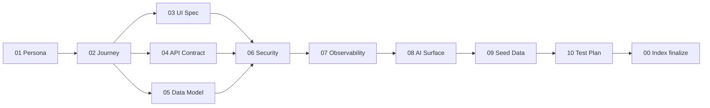

---
# =============================================================================
# SLICE INDEX — orchestrator doc. Fill this LAST, after 01–10 are ready.
# =============================================================================
slice_id: SLICE-<kebab-case-slug>-v1         # [REQUIRED] globally unique
slice_name: <Short human-readable name>       # [REQUIRED]
persona_id: <from 01-PERSONA.md>              # [REQUIRED]
journey_id: <from 02-JOURNEY.md>              # [REQUIRED]
status: draft                                 # draft | ready-to-build | in-progress | shipped
owner: <github-handle>                        # [REQUIRED]
created: <YYYY-MM-DD>
target_demo_date: <YYYY-MM-DD>                # [REQUIRED] forcing function
shipped_date: null
# Sibling doc completion (auto-updated by validators)
completion:
  persona: draft        # draft | ready
  journey: draft
  ui_spec: draft
  api_contract: draft
  data_model: draft
  security: draft
  observability: draft
  ai_surface: draft     # set to "n/a" if slice has no AI component
  seed_data: draft
  test_plan: draft
---

# Slice: {{slice_name}}

## 1. Pitch  [REQUIRED]

One paragraph. Fill the template literally:

> By the end of this slice, **{{persona_name}}** can **{{journey_one_sentence}}**, and we can prove it by **{{observable_outcome_with_metric}}**.

EXAMPLE (do not ship):
> By the end of this slice, Alex Chen (PM at Series-B SaaS) can bookmark any Feature and see it in a pinned sidebar across sessions, and we can prove it by the e2e scenario `bookmark-persists-after-logout` passing AND the `feature.bookmarks.created` metric incrementing on click in Grafana.

## 2. Sibling Documents  [REQUIRED]

All 10 must exist at the paths below. Orchestrator validator checks existence + `status: ready` frontmatter.

| # | Doc | Path | Status |
|---|-----|------|--------|
| 01 | Persona | `./01-PERSONA.md` | {{completion.persona}} |
| 02 | Journey | `./02-JOURNEY.md` | {{completion.journey}} |
| 03 | UI Spec | `./03-UI-SPEC.md` | {{completion.ui_spec}} |
| 04 | API Contract | `./04-API-CONTRACT.md` | {{completion.api_contract}} |
| 05 | Data Model | `./05-DATA-MODEL.md` | {{completion.data_model}} |
| 06 | Security & Tenancy | `./06-SECURITY-TENANCY.md` | {{completion.security}} |
| 07 | Observability | `./07-OBSERVABILITY.md` | {{completion.observability}} |
| 08 | AI Surface | `./08-AI-SURFACE.md` | {{completion.ai_surface}} |
| 09 | Seed Data | `./09-SEED-DATA.md` | {{completion.seed_data}} |
| 10 | Test Plan | `./10-TEST-PLAN.md` | {{completion.test_plan}} |

## 3. Execution Order  [REQUIRED — do not reorder]

Hard gate: code cannot start until 01–05 all report `ready`. 06–10 can fill in parallel with implementation but must close before merge.

## 4. Definition of Done  [REQUIRED — all 15 must check before shipped]

- [ ] 01 Persona: validator PASS (no generic phrases, JTBD has numeric success metric)
- [ ] 02 Journey: validator PASS (every step maps to a screen or backend event)
- [ ] 03 UI Spec: validator PASS (all 7 states per screen, every interaction cites endpoint)
- [ ] 04 API Contract: validator PASS (OpenAPI fragment valid, gateway routes registered)
- [ ] 05 Data Model: validator PASS (`pnpm db:migrate` clean, `org_id` on all tenant tables)
- [ ] 06 Security: validator PASS (permission matrix complete, 0 cross-tenant leaks in authz tests)
- [ ] 07 Observability: validator PASS (every error code emits log event, dashboards live)
- [ ] 08 AI Surface: validator PASS OR `n/a` (eval ≥ threshold, cost within budget, fallback tested)
- [ ] 09 Seed Data: validator PASS (seed runs clean, assertion queries return expected)
- [ ] 10 Test Plan: validator PASS (Gherkin citations resolve, E2E green in CI)
- [ ] End-to-end manual walkthrough: log in as persona, complete golden path, complete 1 atypical path
- [ ] Chaos test: deliberately break tenancy (drop one `org_id` filter) → 06 test catches it
- [ ] Perf test: p99 latency meets SLO at expected concurrent-tenant count from 02
- [ ] Accessibility: axe-core clean on all screens, keyboard-only journey completion verified
- [ ] Release note / changelog entry drafted, linked from this doc

## 5. Risks & Open Questions  [OPTIONAL]

List anything that could block shipping. If this section is non-empty at `status: ready-to-build`, block the status change.

## 6. Metrics to Watch Post-Ship  [REQUIRED]

From `07-OBSERVABILITY.md`. Which 3 metrics will tell us if the slice is working in production?

1. `<metric_name>` — target: `<value>`, alert threshold: `<value>`
2. `<metric_name>` — target: `<value>`, alert threshold: `<value>`
3. `<metric_name>` — target: `<value>`, alert threshold: `<value>`

## 7. Rollback Plan  [REQUIRED]

If the slice ships and goes bad:
- Feature flag name: `<flag>`
- How to disable: `<command or admin action>`
- Data migration reversibility: `<see 05-DATA-MODEL.md §Migration backward>`
- Expected time to rollback: `<minutes>`
