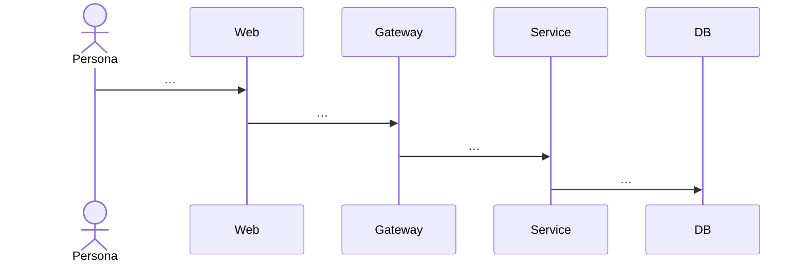

---
# =============================================================================
# JOURNEY — one workflow, trigger to outcome, branches + failure modes included.
# Rule: every step must map to a UI screen (03) OR a backend event (04/07).
# =============================================================================
journey_id: JOURNEY-<kebab>-v1                # [REQUIRED]
persona_id: PERSONA-<from 01>                 # [REQUIRED]
status: draft                                 # draft | ready
frequency: daily | weekly | event-driven | quarterly
criticality: p0 | p1 | p2                     # p0 = slice cannot ship without this
typical_duration_minutes: <n>                 # how long golden path takes end-to-end
tools_replaced:                               # which external tools your platform replaces for this journey
  - <tool>
---

# Journey: {{journey_name}}

## 1. Trigger  [REQUIRED]

What event starts this journey? Pick exactly one.

- [ ] **External event** (customer behavior, integration webhook, external system) — describe: …
- [ ] **Scheduled** (cron, recurring calendar) — describe: …
- [ ] **Manual** (persona navigates to a page, clicks a button) — describe: …
- [ ] **System event** (internal state change, threshold breach) — describe: …

## 2. Success Outcome  [REQUIRED]

What observable state change proves the journey completed? Must be concrete.

| Outcome type | Specific value |
|---|---|
| DB row created/updated in table | `<table>` with fields `<field> = <value>` |
| Event emitted on bus | `<event_name>` with payload `<…>` |
| Email/notification sent | `<to>`, `<subject>`, `<template_id>` |
| Metric incremented | `<metric_name>` by `<n>` |
| External system action | `<system>`, `<action>`, `<expected result>` |
| UI state visible | `<screen>` shows `<text or component>` |

## 3. Golden Path  [REQUIRED — 7–15 steps]

Each step is atomic. No "user does stuff". Every step has a system of record.

**Rule:** the golden path MUST include at least one state-changing step (a domain action: state transition / assignment change / approval / comment write / priority change / share / etc.) sourced from `INTAKE.md § Resolution Loop`. A path that ends on "open detail, back button, close tab" without a write is a view-only slice — in that case §9 Non-Goals must contain an explicit lock naming the deferred action-loop slice.

```yaml
steps:
  - step_id: STEP-001
    actor: persona | system | external
    action: <verb phrase>
    input: <data needed>
    output: <data produced>
    system_of_record: <db table | api endpoint | ui screen | external system>
    screen_id: <from 03 — if UI step>
    endpoint_id: <from 04 — if API step>
    elapsed_seconds: <realistic estimate>
  - step_id: STEP-002
    …
```

Also render as a mermaid diagram for humans:



## 3a. Resolution Loop  [REQUIRED]

Answers the question the golden path does not: *after the persona consumes the surface, what do they do so that they can reach closure on the job-to-be-done and stop thinking about it?* The closure actions are derived in `INTAKE.md § Resolution Loop` by reasoning from the persona's JTBDs + the product boundary in `CLAUDE.md § Module Boundaries` + the state machines in `CLAUDE.md § Key Business Rules`. Every action listed in that INTAKE section must appear here.

Use codebase-literal names in every field. If the domain has a state machine, quote the literal transition (e.g., `DRAFT -> IN_REVIEW`). If the domain has a named audit table, cite it by name. Do NOT copy verbs or table names from another slice.

```yaml
resolution_loop:
  actions:
    - action_id: ACTION-001
      name: <domain-specific verb phrase — use nouns from this slice's owner service, not from examples>
      trigger_step: STEP-00X           # which golden-path step invites this action
      control_id: <from 03 — the control on the UI surface>
      endpoint_id: <from 04 — write endpoint, or "deferred-<slice-id-vN>" when explicitly out of scope>
      permission: <from 06 — permission code enforced at gateway>
      state_transition: <from 05 — literal FROM -> TO from the domain state machine, or "n/a — non-transitional write">
      impact_preview: <shape appropriate to action severity; detailed copy + component live in 03>
      trade_offs_surfaced: <constraints the persona must respect before committing — capacity, dependency, budget, commit, conflict — named per this domain; or "none applicable">
      downstream_routing: <which named services or integrations the action fans out to — echo from INTAKE Resolution Loop; "none — audit log only" is a valid answer>
      reversibility: <undo mechanism; must be consistent with a state-machine rule or audit pattern in 05>
      audit_event: <event name written to the slice's audit table — cite the table by its real name>
      failure_recovery_ref: FAIL-00Y   # which §6 failure mode covers the error branch
    - action_id: ACTION-002
      …
```

**Coverage rule:** each Resolution Loop action must be cross-referenced from (a) at least one golden-path step OR decision branch OR atypical path, and (b) at least one Gherkin scenario in `10-TEST-PLAN.md`. The Phase 5 index agent confirms the cross-reference matrix.

**Empty-loop case:** if this slice is deliberately view-only, the `actions:` list may be empty, but §9 Non-Goals MUST carry an entry of the form: "No write/state-changing actions in v1 — resolution loop owned by slice `<slice-id-vN>`." A missing entry fails the validator. "View only" is never the default; it must be a boundary-citing deliberate scope cut.

## 4. Decision Branches  [REQUIRED — min 3]

```yaml
branches:
  - branch_id: BRANCH-001
    at_step: STEP-00X
    condition: <explicit predicate>
    path_a:
      label: <name>
      expected_pct: <n>
      goes_to: STEP-00Y
    path_b:
      label: <name>
      expected_pct: <n>
      goes_to: STEP-00Z
```

## 5. Atypical Paths  [REQUIRED — min 2]

### Atypical-1: `<name>`
- When does this happen (persona context):
- Step sequence delta (vs golden path):
- Which UI screens get different treatment:
- Which API endpoints see unusual payloads:

### Atypical-2: `<name>`

## 6. Failure Modes  [REQUIRED — min 3]

```yaml
failure_modes:
  - failure_id: FAIL-001
    at_step: STEP-00X
    cause: <db timeout | downstream 5xx | validation reject | rate limit | AI provider down>
    detection: <how we know it happened — metric, log, user report>
    user_visible_symptom: <what persona sees>
    recovery_action: <automatic retry | manual retry | escalate | fallback UI>
    pages_on_call: yes | no
    alert_name: <from 07-OBSERVABILITY>
```

## 7. Current-State Pain (pre-product)  [REQUIRED]

How does {{persona_name}} do this journey today, WITHOUT your product?

| Step | Current tool | Manual effort | Time cost |
|---|---|---|---|
| | | | |
| | | | |

**Total time cost today:** `<n> hours/week`
**Error rate today:** `<n>%` (or estimate)

## 8. Future-State Delta  [REQUIRED]

What specifically changes after your product ships this slice?

| Dimension | Before | After | Delta |
|---|---|---|---|
| Time to complete | | | |
| # systems touched | | | |
| Manual decisions required | | | |
| Data freshness | | | |
| Auditability | | | |

## 9. Non-Goals  [REQUIRED]

Explicitly what this journey does NOT cover. Prevents scope creep when building.

- Not …
- Not …
- Not …

## 10. Dependencies on Other Slices  [OPTIONAL]

If this journey requires another slice to ship first (e.g. authentication slice before a logged-in journey), list here.

| Slice ID | What we need from it | Can we mock for demo? |
|---|---|---|

## 11. Validator Will Fail If …

- Fewer than 7 steps in golden path
- Any step without `screen_id` or `endpoint_id`
- Fewer than 3 decision branches
- Fewer than 2 atypical paths
- Fewer than 3 failure modes
- Current-state pain section is empty or "persona does it manually in Excel" (not specific enough)
- Trigger is ambiguous (more than one box checked without a clear primary)
- Success outcome is not testable (e.g., "user is happy" instead of "row inserted in table")
- §3a Resolution Loop missing entirely
- §3a `actions` list is empty AND §9 Non-Goals has no "No write actions in v1 — owned by slice `<id>`" lock
- Any Resolution Loop action lacks `control_id`, `endpoint_id`, `impact_preview`, or `reversibility`
- Any action in `INTAKE.md § Resolution Loop` is not echoed in §3a (missing cross-reference)
- Any §3a action is not also cited by at least one step / branch / atypical / Gherkin scenario
