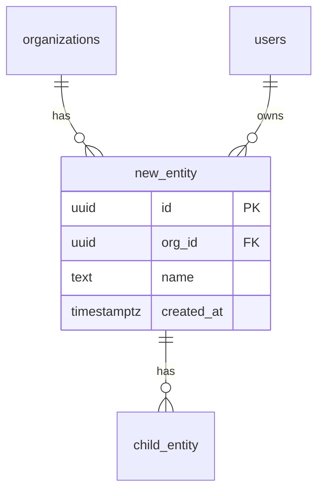

---
# =============================================================================
# DATA MODEL — tables, columns, indexes, FKs, migrations, invariants.
# Rule: DDL must execute clean on empty DB; every tenant table has org_id.
# =============================================================================
slice_id: <from 00>                           # [REQUIRED]
status: draft                                 # draft | ready
service_owner: <svc>-svc                      # [REQUIRED] one of 16 services
schema_namespace: <svc>                       # matches service owner
tables_added:                                 # [REQUIRED]
  - <table_name>
tables_modified:                              # [OPTIONAL]
  - <table_name>
migration_forward_path: packages/database/postgresql/migrations/<nnn>_<slug>.sql
migration_backward_path: packages/database/postgresql/migrations/<nnn>_<slug>.down.sql
---

# Data Model: {{slice_name}}

## 1. Entity Relationship  [REQUIRED]

Mermaid ER diagram — how new entities connect to existing ones.



## 2. DDL — New Tables  [REQUIRED]

```sql
-- Follows your project's CLAUDE.md conventions. Example conventions:
-- - org_id on every tenant-scoped table (or tenant_id for sub-domains with distinct isolation)
-- - snake_case names
-- - id: uuid DEFAULT gen_random_uuid() PRIMARY KEY
-- - created_at + updated_at timestamptz DEFAULT now()
-- - soft delete: deleted_at timestamptz NULL (only if entity supports undelete)
-- - constraints named: <table>_<column>_<kind>

CREATE TABLE IF NOT EXISTS <schema>.<table_name> (
  id            uuid PRIMARY KEY DEFAULT gen_random_uuid(),
  org_id        uuid NOT NULL REFERENCES public.organizations(id) ON DELETE CASCADE,
  -- domain columns
  name          text NOT NULL,
  status        text NOT NULL DEFAULT 'active',
  -- audit
  created_by    uuid REFERENCES public.users(id),
  updated_by    uuid REFERENCES public.users(id),
  created_at    timestamptz NOT NULL DEFAULT now(),
  updated_at    timestamptz NOT NULL DEFAULT now(),
  deleted_at    timestamptz NULL,
  -- invariants
  CONSTRAINT <table>_status_chk CHECK (status IN ('active','archived','pending')),
  CONSTRAINT <table>_name_not_empty_chk CHECK (length(trim(name)) > 0)
);
```

## 3. Indexes  [REQUIRED]

Every index must name the query pattern it serves (from 04 endpoints).

```sql
-- Lookups by tenant (every list endpoint)
CREATE INDEX <table>_org_idx ON <schema>.<table_name> (org_id) WHERE deleted_at IS NULL;

-- Sort by recency (default list ordering)
CREATE INDEX <table>_org_created_idx ON <schema>.<table_name> (org_id, created_at DESC) WHERE deleted_at IS NULL;

-- Unique constraint (business rule: names unique within tenant)
CREATE UNIQUE INDEX <table>_org_name_unique ON <schema>.<table_name> (org_id, lower(name)) WHERE deleted_at IS NULL;
```

| Index | Serves query (endpoint_id) | Type | Partial? |
|---|---|---|---|
| | | | |

## 4. Foreign Keys & Cascade Policy  [REQUIRED]

| FK | References | ON DELETE | ON UPDATE | Reason |
|---|---|---|---|---|
| `<table>.org_id` | `organizations(id)` | CASCADE | CASCADE | tenant removal |
| `<table>.parent_id` | `<parent>(id)` | RESTRICT | CASCADE | cannot delete if referenced (per CLAUDE.md) |

## 5. Invariants  [REQUIRED]

### 5a. DB-enforced (CHECK / UNIQUE / NOT NULL / FK)
- `<table>`: `status IN ('active','archived','pending')`
- `<table>`: name unique per org (case-insensitive)
- …

### 5b. App-layer only (document for code reviewers — DB can't enforce)
- When `status='archived'`, new children must not be allowed (enforced in handler `<svc>/handlers/<file>.ts`)
- Reference count before delete (enforced by `db.canDelete()` helper)
- …

## 6. Modifications to Existing Tables  [REQUIRED IF ANY]

```sql
ALTER TABLE <schema>.<existing_table>
  ADD COLUMN IF NOT EXISTS <new_col> <type> <default/null>;

-- Backfill if needed
UPDATE <schema>.<existing_table> SET <new_col> = <default> WHERE <new_col> IS NULL;
```

Data backfill risk:
| Table | Row count estimate | Backfill strategy | Downtime? |
|---|---|---|---|
| | | | |

## 7. Migration Scripts  [REQUIRED]

### Forward migration
Path: `packages/database/postgresql/migrations/<nnn>_<slug>.sql`

Paste the full forward migration here (CREATE + INDEX + ALTER in correct order).

### Backward migration
Path: `packages/database/postgresql/migrations/<nnn>_<slug>.down.sql`

Paste the full reverse (DROP INDEX, DROP TABLE, ALTER … DROP COLUMN). Verify running forward then backward returns to original schema.

### Docker init sync (per CLAUDE.md common mistake)
- [ ] `infrastructure/docker/postgres/init/02-schema.sql` updated
- [ ] `packages/database/postgresql/schema.sql` updated (authoritative snapshot)

## 8. Row-Count Projections  [REQUIRED]

| Tenant scale | `<table_a>` rows | `<table_b>` rows | Index size estimate |
|---|---|---|---|
| 1k tenants × avg usage | | | |
| 100k tenants × avg usage | | | |
| 1M tenants × avg usage | | | |

If any table projects > 1B rows at 1M tenants: document partition strategy.

## 9. Sample Rows  [REQUIRED — 3 per new table]

These duplicate into 09-SEED-DATA.md verbatim.

```sql
INSERT INTO <schema>.<table_name> (id, org_id, name, status, created_at)
VALUES
  ('01HXX…', '<seed-org-id>', '<recognizable-name-1>', 'active', now()),
  ('01HXY…', '<seed-org-id>', '<recognizable-name-2>', 'archived', now() - interval '7 days'),
  ('01HXZ…', '<seed-org-id>', '<recognizable-name-3>', 'pending', now() - interval '1 hour');
```

## 10. Query Patterns  [REQUIRED]

For each endpoint in 04, the primary SQL it issues. Handlers should match these exactly.

```sql
-- ENDPOINT-001 (POST /api/v1/…)
INSERT INTO <schema>.<table> (org_id, name, created_by)
VALUES ($1, $2, $3)
RETURNING *;

-- ENDPOINT-002 (GET /api/v1/…)
SELECT * FROM <schema>.<table>
WHERE org_id = $1 AND deleted_at IS NULL
ORDER BY created_at DESC
LIMIT $2;
```

## 11. Validator Will Fail If …

- Any tenant-scoped table missing `org_id` or `tenant_id`
- Any table missing `created_at`/`updated_at`
- CHECK constraints unnamed
- Migration forward + backward not reversible
- Index column not justified by an endpoint_id from 04
- Docker init schema not updated (CLAUDE.md common mistake)
- Sample rows use round-number IDs instead of ULIDs/UUIDs
- FK cascade policy not specified per FK
