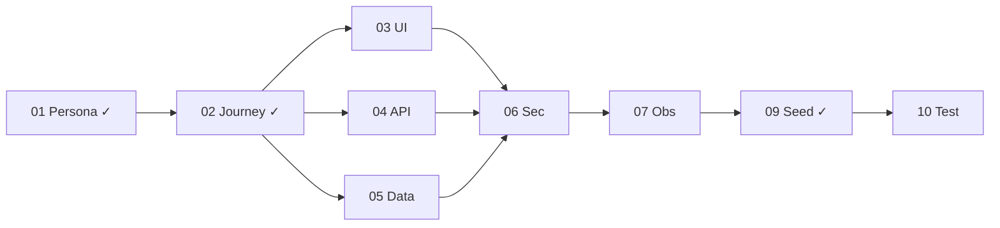

# Slice: Feature Bookmarks

## 1. Pitch

> By the end of this slice, **Alex Chen** (Senior PM at a Series-B B2B SaaS) can **bookmark any Feature from the Roadmap and have those bookmarks persist in a pinned sidebar across browser sessions and devices**, and we can prove it by the e2e scenario `bookmark-persists-after-logout` passing, the metric `product.bookmarks.created.total` incrementing on every click in Grafana, and Alex reporting in a manual walkthrough that she can reach her 3 most-watched features in ≤ 2 clicks from any page.

## 2. Sibling Documents

| # | Doc | Path | Status |
|---|-----|------|--------|
| 01 | Persona | `./01-PERSONA.md` | ready |
| 02 | Journey | `./02-JOURNEY.md` | ready |
| 03 | UI Spec | `./03-UI-SPEC.md` | draft |
| 04 | API Contract | `./04-API-CONTRACT.md` | draft |
| 05 | Data Model | `./05-DATA-MODEL.md` | draft |
| 06 | Security & Tenancy | `./06-SECURITY-TENANCY.md` | draft |
| 07 | Observability | `./07-OBSERVABILITY.md` | draft |
| 08 | AI Surface | `./08-AI-SURFACE.md` | n/a |
| 09 | Seed Data | `./09-SEED-DATA.md` | ready |
| 10 | Test Plan | `./10-TEST-PLAN.md` | draft |

## 3. Execution Order

## 4. Definition of Done

- [x] 01 Persona: validator PASS
- [x] 02 Journey: validator PASS
- [ ] 03 UI Spec: validator PASS
- [ ] 04 API Contract: validator PASS
- [ ] 05 Data Model: validator PASS
- [ ] 06 Security: validator PASS
- [ ] 07 Observability: validator PASS
- [x] 08 AI Surface: n/a (no AI)
- [x] 09 Seed Data: validator PASS
- [ ] 10 Test Plan: validator PASS
- [ ] E2E manual walkthrough completed
- [ ] Chaos test: tenancy break caught
- [ ] Perf p99 ≤ SLO
- [ ] axe-core clean; keyboard-only journey completes
- [ ] Release note drafted

## 5. Risks & Open Questions

- Do bookmarks belong in `product-svc` (feature domain) or `auth-svc` (user-preferences domain)? → Decision: `product-svc` because bookmarks are entity-scoped and must respect feature visibility rules.
- Sidebar component: reuse existing `PinnedList` or build new? → Reuse; add `itemType` prop.

## 6. Metrics to Watch Post-Ship

1. `product.bookmarks.created.total` — target: ≥ 500/week across all tenants by week 2, alert threshold: < 50/week (under-adoption signal)
2. `product.bookmarks.list.duration.seconds` p99 — target: ≤ 0.2s, alert threshold: > 0.5s for 10m
3. `product.bookmarks.cross_tenant_leak_attempts` — target: 0, alert threshold: > 0 (security)

## 7. Rollback Plan

- Feature flag: `features.bookmarks.enabled` (GrowthBook, default off on first deploy)
- Disable: toggle off in GrowthBook — UI hides within 60s (polling interval)
- Data reversibility: forward migration adds `product.bookmarks` table; backward drops it. Data loss risk = minimal (opt-in feature, no other table depends on it)
- Expected rollback time: ≤ 5 minutes
