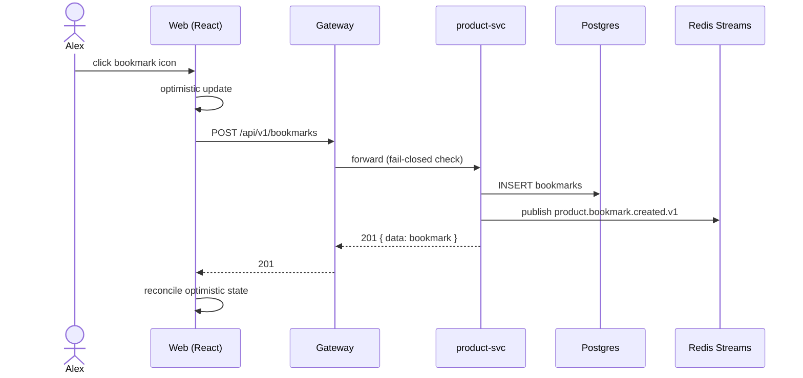

# Journey: Bookmark a Feature & Access It Later

## 1. Trigger

- [x] **Manual** — Alex navigates to the Roadmap or Feature list, hovers/clicks a feature she wants to track later.
- [ ] External event
- [ ] Scheduled
- [ ] System event

## 2. Success Outcome

| Outcome type | Specific value |
|---|---|
| DB row created | `product.bookmarks` row where `user_id = alex.id` and `feature_id = sso.id` |
| Event emitted | `product.bookmark.created.v1` on Redis stream |
| Metric incremented | `product.bookmarks.created.total{tenant_id=flowroom}` +1 |
| UI state visible | Bookmark icon on Feature row shows filled state; sidebar `<BookmarkSidebar>` shows feature within 500ms |

Persistence verified by: logging out, closing browser, reopening next day → bookmark still in sidebar.

## 3. Golden Path

```yaml
steps:
  - step_id: STEP-001
    actor: persona
    action: navigate to /features
    input: session JWT
    output: UI rendered with feature list
    system_of_record: ui-screen
    screen_id: UI-001
    elapsed_seconds: 2
  - step_id: STEP-002
    actor: persona
    action: hover over feature row
    input: row focus
    output: bookmark icon visible (from icon-on-hover pattern)
    system_of_record: ui-screen
    screen_id: UI-001
    elapsed_seconds: 0.3
  - step_id: STEP-003
    actor: persona
    action: click bookmark icon
    input: feature_id
    output: optimistic UI update — icon filled
    system_of_record: ui-screen
    screen_id: UI-001
    elapsed_seconds: 0.1
  - step_id: STEP-004
    actor: system
    action: POST bookmark
    input: { feature_id }
    output: 201 Created with bookmark row
    system_of_record: api-endpoint
    endpoint_id: ENDPOINT-001
    elapsed_seconds: 0.15
  - step_id: STEP-005
    actor: system
    action: publish event
    input: bookmark row
    output: product.bookmark.created.v1 on stream
    system_of_record: event-bus
    elapsed_seconds: 0.05
  - step_id: STEP-006
    actor: system
    action: update BookmarkSidebar (TanStack cache + websocket push)
    input: new bookmark
    output: sidebar item appears with transition
    system_of_record: ui-screen
    screen_id: UI-002
    elapsed_seconds: 0.2
  - step_id: STEP-007
    actor: persona
    action: navigate away (to /dashboard)
    input: —
    output: BookmarkSidebar still shows the feature (persistent across routes)
    system_of_record: ui-screen
    screen_id: UI-002
    elapsed_seconds: 1
  - step_id: STEP-008
    actor: persona
    action: log out + log back in (next day)
    input: credentials
    output: BookmarkSidebar loads from GET bookmarks, shows SSO feature
    system_of_record: api-endpoint
    endpoint_id: ENDPOINT-002
    elapsed_seconds: 3
```



## 4. Decision Branches

```yaml
branches:
  - branch_id: BRANCH-001
    at_step: STEP-003
    condition: feature already bookmarked by this user
    path_a:
      label: toggle off (unbookmark)
      expected_pct: 20
      goes_to: STEP-004-UNBOOKMARK (DELETE endpoint)
    path_b:
      label: first bookmark
      expected_pct: 80
      goes_to: STEP-004
  - branch_id: BRANCH-002
    at_step: STEP-003
    condition: user has ≥ 50 bookmarks already
    path_a:
      label: show warning "limit 50 per user" + offer to remove oldest
      expected_pct: 2
      goes_to: UI modal
    path_b:
      label: proceed normally
      expected_pct: 98
      goes_to: STEP-004
  - branch_id: BRANCH-003
    at_step: STEP-006
    condition: sidebar is collapsed
    path_a:
      label: show badge on collapsed sidebar icon
      expected_pct: 35
      goes_to: UI-002 collapsed state
    path_b:
      label: show inline item addition with transition
      expected_pct: 65
      goes_to: UI-002 expanded state
```

## 5. Atypical Paths

### Atypical-1: Board-Week Power-Pin
- When: day before Sarah's board deck is due
- Delta: Alex bookmarks 8 features in a 2-minute span (batch behavior)
- UI differences: bulk-select mode becomes useful; rate-limit threshold should not trigger at 8 in 2 minutes
- API differences: POST volume spikes; must tolerate burst without throttling a legitimate user

### Atypical-2: Sharing via URL
- When: Alex wants to send Sarah her current bookmark list during 1:1
- Delta: Alex copies a URL `/bookmarks?share=<hash>` — read-only view of her bookmarks
- UI differences: new shareable view; respects Sarah's feature-visibility permissions (some of Alex's bookmarks may be hidden from Sarah)
- API differences: new GET endpoint with signed/opaque share token; must re-check visibility at view time

## 6. Failure Modes

```yaml
failure_modes:
  - failure_id: FAIL-001
    at_step: STEP-004
    cause: gateway returns 403 (route not in permissions table — fail-closed)
    detection: metric product.bookmarks.permission_denied.total spikes
    user_visible_symptom: icon reverts + toast "You don't have access to bookmark features"
    recovery_action: manual retry not useful; admin must add permission row
    pages_on_call: yes (p1 — feature completely broken)
    alert_name: bookmark_permission_denied_high
  - failure_id: FAIL-002
    at_step: STEP-004
    cause: DB write fails (unique constraint — race between two tabs)
    detection: metric product.bookmarks.conflict.total
    user_visible_symptom: icon shows filled state (idempotent outcome); no error toast
    recovery_action: server treats duplicate as success (idempotent insert ON CONFLICT DO NOTHING)
    pages_on_call: no
    alert_name: none (expected low-rate event)
  - failure_id: FAIL-003
    at_step: STEP-004 through STEP-006
    cause: network timeout mid-request
    detection: metric product.bookmarks.request.duration p99 > 2s
    user_visible_symptom: icon reverts after 3s optimistic window + retry toast
    recovery_action: retry button in toast; bookmark not persisted
    pages_on_call: no (single-user event)
    alert_name: bookmark_latency_breach
  - failure_id: FAIL-004
    at_step: STEP-008
    cause: stale cache on login — sidebar loads from pre-logout cache that's missing recent bookmark
    detection: UX report; metric bookmark.sidebar.stale.ratio (if we instrument)
    user_visible_symptom: bookmark missing from sidebar until page refresh
    recovery_action: auto-refetch on mount with stale-while-revalidate
    pages_on_call: no
    alert_name: none
```

## 7. Current-State Pain (pre-product)

| Step | Current tool | Manual effort | Time cost |
|---|---|---|---|
| "I want to watch this" | Chrome bookmark bar | right-click → bookmark → clutter grows | 30s × 10/day = 5 min/day |
| "Where was that thing?" | search Notion "My Brain" | grep through URLs | 3 min × 3/day = 9 min/day |
| "Share my list" | Google Doc of Linear links | copy-paste, format | 15 min × 1/week |

**Total time cost today:** ~70 min/week per PM
**Error rate today:** ~40% of "flagged" items dropped (self-reported)

## 8. Future-State Delta

| Dimension | Before | After | Delta |
|---|---|---|---|
| Time to bookmark | ~10s (bookmark bar) | ~1s (click icon) | 10× |
| Time to find | ~3 min (Notion search) | ~2s (sidebar) | 90× |
| Drop rate of flagged items | ~40% | target < 10% | 4× |
| Cross-device availability | manual copy-paste | automatic | — |
| Auditability (who bookmarked what) | none | logged | n/a → full |

## 9. Non-Goals

- Not building tags or folders for bookmarks. Pure flat list. Any categorization is scope creep.
- Not a "recommendations" feature (AI-suggested bookmarks). That's a separate future slice.
- Not a team-shared bookmark list (each user's bookmarks are personal). Sharing is via read-only URL in Atypical-2.
- Not bookmarking Customers, Deals, or other entities. Feature-only in v1.

## 10. Dependencies on Other Slices

| Slice ID | What we need from it | Can mock for demo? |
|---|---|---|
| existing: auth-session-v1 | logged-in user context | n/a — already shipped |
| existing: feature-crud-v1 | list of features in `product.features` | n/a — already shipped |
