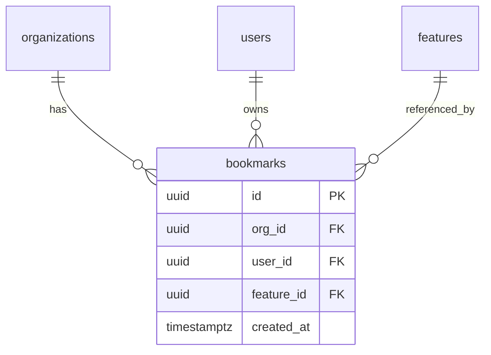

# Data Model: Feature Bookmarks

## 1. Entity Relationship



Bookmarks are a simple join entity. No soft-delete (unbookmark is a hard delete — cheap to re-bookmark).

## 2. DDL — New Tables

```sql
-- product.bookmarks — a user's pinned features within a tenant
CREATE TABLE IF NOT EXISTS product.bookmarks (
  id          uuid PRIMARY KEY DEFAULT gen_random_uuid(),
  org_id      uuid NOT NULL REFERENCES public.organizations(id) ON DELETE CASCADE,
  user_id     uuid NOT NULL REFERENCES public.users(id)         ON DELETE CASCADE,
  feature_id  uuid NOT NULL REFERENCES product.features(id)     ON DELETE CASCADE,
  created_at  timestamptz NOT NULL DEFAULT now(),
  CONSTRAINT bookmarks_user_feature_unique UNIQUE (user_id, feature_id)
);
```

## 3. Indexes

| Index | Serves | Type | Partial? |
|---|---|---|---|
| `bookmarks_pkey` | point lookup by id (DELETE) | btree | no |
| `bookmarks_user_feature_unique` | idempotent create; `WHERE user_id=$1 AND feature_id=$2` | unique btree | no |
| `bookmarks_user_created_idx` | list for sidebar (ENDPOINT-002) ordered newest-first | btree | no |
| `bookmarks_org_idx` | cross-tenant isolation enforcement queries | btree | no |

```sql
CREATE INDEX bookmarks_user_created_idx ON product.bookmarks (user_id, created_at DESC);
CREATE INDEX bookmarks_org_idx          ON product.bookmarks (org_id);
```

## 4. Foreign Keys & Cascade Policy

| FK | References | ON DELETE | ON UPDATE | Reason |
|---|---|---|---|---|
| `bookmarks.org_id` | `organizations(id)` | CASCADE | CASCADE | tenant removed → bookmarks gone |
| `bookmarks.user_id` | `users(id)` | CASCADE | CASCADE | user removed → their bookmarks gone |
| `bookmarks.feature_id` | `features(id)` | CASCADE | CASCADE | feature deleted → dangling bookmarks gone |

Rationale: bookmarks are derived/personal state. Losing them on any parent delete is expected. No "cannot delete if referenced" rule from CLAUDE.md applies here (bookmarks are never referenced by other entities).

## 5. Invariants

### 5a. DB-enforced

- `UNIQUE (user_id, feature_id)` — a user cannot bookmark the same feature twice. Enforced by constraint, making POST idempotent via `ON CONFLICT DO NOTHING`.
- `NOT NULL` on all FK columns — no orphans.

### 5b. App-layer only

- **Visibility scope honored at create time:** when POSTing, handler must verify the feature is visible to this user (e.g., a `director_only` feature cannot be bookmarked by an IC). Enforced in `apps/services/product-svc/handlers/bookmarks.ts` via a join on `features.visibility_scope`.
- **Soft limit: 50 bookmarks per user.** No DB constraint (cheap to exceed), but handler warns via 422 if user hits 50, matching BRANCH-002 in 02-JOURNEY.

## 6. Modifications to Existing Tables

None. The feature table is read-only to this slice.

## 7. Migration Scripts

### Forward
Path: `packages/database/postgresql/migrations/0142_product_bookmarks.sql`

```sql
BEGIN;

CREATE TABLE IF NOT EXISTS product.bookmarks (
  id          uuid PRIMARY KEY DEFAULT gen_random_uuid(),
  org_id      uuid NOT NULL REFERENCES public.organizations(id) ON DELETE CASCADE,
  user_id     uuid NOT NULL REFERENCES public.users(id)         ON DELETE CASCADE,
  feature_id  uuid NOT NULL REFERENCES product.features(id)     ON DELETE CASCADE,
  created_at  timestamptz NOT NULL DEFAULT now(),
  CONSTRAINT bookmarks_user_feature_unique UNIQUE (user_id, feature_id)
);

CREATE INDEX IF NOT EXISTS bookmarks_user_created_idx ON product.bookmarks (user_id, created_at DESC);
CREATE INDEX IF NOT EXISTS bookmarks_org_idx          ON product.bookmarks (org_id);

COMMIT;
```

### Backward
Path: `packages/database/postgresql/migrations/0142_product_bookmarks.down.sql`

```sql
BEGIN;
DROP INDEX IF EXISTS product.bookmarks_org_idx;
DROP INDEX IF EXISTS product.bookmarks_user_created_idx;
DROP TABLE IF EXISTS product.bookmarks;
COMMIT;
```

### Docker init sync
- [x] `infrastructure/docker/postgres/init/02-schema.sql` — append the CREATE TABLE + indexes to the `product` schema section.
- [x] `packages/database/postgresql/schema.sql` — authoritative snapshot updated.

## 8. Row-Count Projections

| Tenant scale | bookmarks rows | Index size estimate |
|---|---|---|
| 1k tenants × 5 active PMs × 15 bookmarks | ~75k | < 20 MB total |
| 100k tenants × 5 × 15 | ~7.5M | ~2 GB |
| 1M tenants × 5 × 15 | ~75M | ~20 GB |

No partitioning needed even at 1M tenants. `user_id` lookups are well-indexed; writes are low-frequency.

## 9. Sample Rows

See `09-SEED-DATA.md` §6 — one pre-existing bookmark seeded for Alex on "Presence Indicators" to exercise BRANCH-001 (unbookmark path).

```sql
INSERT INTO product.bookmarks (id, org_id, user_id, feature_id, created_at)
VALUES
  ('bbbbbbb1-0000-0000-0000-000000000001',
   '11111111-1111-1111-1111-111111111111',
   '22222222-2222-2222-2222-222222222222',
   'aaaaaaa1-0000-0000-0000-000000000003',
   now() - interval '1 day')
ON CONFLICT (user_id, feature_id) DO NOTHING;
```

## 10. Query Patterns

```sql
-- ENDPOINT-001 POST /api/v1/bookmarks  (idempotent create)
INSERT INTO product.bookmarks (org_id, user_id, feature_id)
SELECT $1, $2, $3
WHERE EXISTS (
  -- feature must be visible to this user's org
  SELECT 1 FROM product.features
   WHERE id = $3 AND org_id = $1
     AND (visibility_scope IS NULL OR visibility_scope = 'all'
          OR EXISTS (SELECT 1 FROM public.user_roles ur
                      JOIN public.roles r ON r.id = ur.role_id
                     WHERE ur.user_id = $2
                       AND r.code = visibility_scope))
)
ON CONFLICT (user_id, feature_id) DO NOTHING
RETURNING *;

-- ENDPOINT-002 GET /api/v1/bookmarks  (sidebar load, newest first)
SELECT b.id, b.feature_id, b.created_at,
       f.name    AS feature_name,
       f.status  AS feature_status
  FROM product.bookmarks b
  JOIN product.features  f ON f.id = b.feature_id
 WHERE b.org_id  = $1
   AND b.user_id = $2
 ORDER BY b.created_at DESC
 LIMIT $3;

-- ENDPOINT-003 DELETE /api/v1/bookmarks/:featureId  (unbookmark, idempotent)
DELETE FROM product.bookmarks
 WHERE org_id = $1 AND user_id = $2 AND feature_id = $3
 RETURNING id;
```
